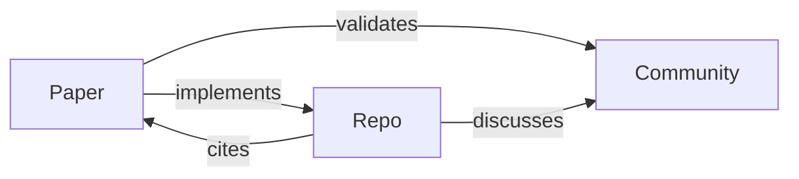

# Cross-Domain Relationship Tracker / 跨域关系追踪器

## STATUS
✅ **Active** - v2.0 integrated with SemanticMemory
Implementation: `tools/cross_domain_tracker.py`
Agent: `.claude/agents/cross-domain-tracker.md`
Used by: `literature-analyzer`, report writers

## Overview / 概述

Cross-Domain Relationship Tracker v2.0 - Query layer on SemanticMemory for analyzing relationships between research domains (Academic, GitHub, Community).

Based on: [MAGMA: Multi-Graph Agentic Memory Architecture](https://arxiv.org/abs/2601.03236) [arXiv:2601.03236](https://arxiv.org/abs/2601.03236)

---

## Relationship Types / 关系类型

```python
class RelationshipType(Enum):
    PAPER_TO_REPO = "implements"        # Paper implemented by repo
    PAPER_TO_COMMUNITY = "validates"    # Paper discussed in community
    REPO_TO_COMMUNITY = "discusses"     # Repo discussed in community
    REPO_TO_PAPER = "cites"             # Repo README cites paper
    PAPER_TO_PAPER = "cites"            # Paper cites another paper
    REPO_TO_REPO = "forks"              # Repo forks another
    COMMUNITY_TO_COMMUNITY = "references"  # Discussion references another
```

---

## Domain Mappings / 域映射

### Paper → Repo (implements)
**Evidence patterns**:
- README mentions paper title or arXiv ID
- Code implements algorithm from paper
- Documentation cites paper

**Example**:
```
paper: "2501.03236" (MAGMA Memory)
  → implements →
repo: "anthropics/claude-code"
```

### Paper → Community (validates)
**Evidence patterns**:
- Reddit/HN discussion about paper
- Community review/analysis
- Citation in blog posts

**Example**:
```
paper: "2506.12508" (AgentOrchestra)
  → validates →
community: "HN Discussion: Agent orchestration patterns"
```

### Repo → Community (discusses)
**Evidence patterns**:
- Reddit post about repository
- HN discussion of project
- GitHub issues/discussions

**Example**:
```
repo: "langchain-ai/langgraph"
  → discusses →
community: "Reddit: LangGraph vs CrewAI"
```

### Repo → Paper (cites)
**Evidence patterns**:
- README.md cites academic papers
- Documentation references research
- Implementation notes mention papers

**Example**:
```
repo: "microsoft/autogen"
  → cites →
paper: "2308.08155" (AutoGen original)
```

---

## Cross-Domain Graph / 跨域图

**Three research domains**:
1. **Academic** (arXiv papers) - Blue `#3498db`
2. **GitHub** (repositories) - Green `#2ecc71`
3. **Community** (discussions) - Orange `#e67e22`

**Graph structure**:


---

## Bridging Entities / 桥接实体

**Definition**: Entities that connect multiple domains

```python
@dataclass
class BridgingEntity:
    entity_id: str
    entity_type: str  # "paper", "repo", "community"
    domains_connected: Set[str]
    connection_count: int
    importance_score: float
```

**Examples**:

**Paper as bridge** (connects to repos and communities):
```
paper: "2506.12508" (AgentOrchestra)
  → implements → repos: [autogen, crewai-langchain]
  → validates → communities: [HN discussion, Reddit thread]
domains_connected: {"repo", "community"}
```

**Repo as bridge** (connects to papers and communities):
```
repo: "langchain-ai/langgraph"
  → cites → papers: [AgentOrchestra, GraphRAG]
  → discusses → communities: [HN discussion, GitHub issues]
domains_connected: {"paper", "community"}
```

---

## Sentiment Analysis / 情感分析

```python
class Sentiment(Enum):
    POSITIVE = "positive"   # Supportive, endorsement
    NEUTRAL = "neutral"     # Factual, informational
    NEGATIVE = "negative"   # Critical, concerns
    MIXED = "mixed"         # Both positive and negative
```

**Usage in community discussions**:
- Paper validation with sentiment
- Framework comparison feedback
- Technical debate analysis

---

## Query Patterns / 查询模式

### Find implementations of a paper
```python
repos = tracker.get_repos_for_paper("2506.12508")
# Returns: {"microsoft/autogen", "crewAIInc/crewAI", ...}
```

### Find papers implemented by a repo
```python
papers = tracker.get_papers_for_repo("microsoft/autogen")
# Returns: {"2308.08155", "2506.12508", ...}
```

### Find community discussions about a paper
```python
discussions = tracker.get_communities_for_paper("2501.03236")
# Returns: {"HN: MAGMA discussion", "Reddit: analysis", ...}
```

### Find bridging entities
```python
bridging = tracker.find_bridging_entities(min_domains=2)
# Returns papers/repos that connect multiple domains
```

---

## CLI Usage / 命令行使用

```bash
# Load research data and show statistics
python "tools\cross_domain_tracker.py" --load-data research_data --stats

# Show bridging entities
python "tools\cross_domain_tracker.py" --load-data research_data --bridging

# Save tracker state
python "tools\cross_domain_tracker.py" --load-data research_data --save cross_domain_state.json
```

---

## Integration with Research Data / 与研究数据集成

**Auto-loading from research outputs**:

```python
tracker.load_from_research_data("research_data")
```

**Loads from**:
- `academic_research_output.json` → Papers
- `github_research_output.json` → Repos + paper implementations
- `community_research_output.json` → Discussions + paper/repo mentions
- `logic_analysis.json` → Paper-to-paper citations

---

## Data Output / 数据输出

**Cross-domain graph for visualization**:
```python
graph = tracker.get_cross_domain_graph()
# Returns:
{
    "nodes": [...],  # Papers, repos, communities
    "edges": [...],  # Relationships
    "stats": {
        "total_nodes": 100,
        "total_edges": 250,
        "papers": 30,
        "repos": 25,
        "communities": 45
    }
}
```

---

## Related Knowledge / 相关知识

- **memory_graph.md**: Knowledge graph implementation for relationships
- **visualization_patterns.md**: Visualizing cross-domain graphs
- **memory_system.md**: MAGMA architecture for cross-domain memory

---

## Storage Format / 存储格式

**JSON structure**:
```json
{
  "papers": {"2501.03236": {"title": "...", ...}},
  "repos": {"langchain-ai/langgraph": {...}},
  "communities": {"hn_12345": {...}},
  "relationships": [...],
  "paper_to_repo": {"2501.03236": ["repo1", "repo2"]},
  "paper_to_community": {"2501.03236": ["disc1", "disc2"]},
  "bridging_entities": [...]
}
```

---

## Usage in Reports / 报告中使用

### How to Reference Cross-Domain Findings

**In Comprehensive Reports (deep-research-report-writer)**:
- **Implementation Gaps**: Mention papers without GitHub implementations
- **Community Validation**: Highlight papers with strong community discussion
- **Bridging Entities**: Feature papers/repos that connect multiple domains

**Example sentences**:
```
- "Paper X (arXiv:2506.12508) has 5 production implementations, including [microsoft/autogen] and [crewAIInc/crewAI]"
- "Unlike AgentOrchestra which has multiple implementations, Paper Y (arXiv:2308.08155) lacks open-source code"
- "Community discussions on Hacker News and Reddit validate the practical relevance of [langchain-ai/langgraph]"
```

**In Literature Reviews (literature-review-writer)**:
- **Evolution tracking**: "The research evolved from Paper X → implementations → community refinement"
- **Evidence levels**: "Strong validation: 3 implementations + 10 community discussions"
- **Research gaps**: "No implementation found for theoretical paper Y"

**In Visualizations (visualization-generator)**:
- Use color coding: Blue (papers), Green (repos), Orange (communities)
- Highlight bridging entities with larger nodes
- Show edge weights based on connection strength

### Cross-Domain Insights to Include

| Insight Type | Description | Example in Report |
|--------------|-------------|-------------------|
| **Implementation Gap** | Papers without GitHub code | "Paper X remains unimplemented" |
| **Community Validation** | Papers discussed in community | "Paper X validated on HN (200 upvotes)" |
| **Production Adoption** | Repos implementing papers | "5 production repos use Paper X's approach" |
| **Bridging Entity** | Connects multiple domains | "Repo Y bridges 3 research domains" |
| **Consensus** | Community agreement | "85% positive sentiment for LangGraph" |
