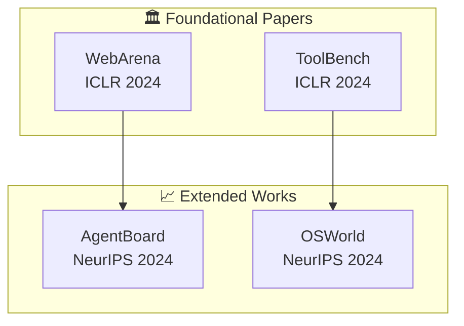

# Deep Research Report Template / 深度研究报告模板

> **Purpose**: Detailed report structure for Gemini Deep Research style comprehensive reports (8 sections).
> **Usage**: Reference this file via `@knowledge:deep_research_template.md`
> **Related**: `report_templates.md` (report format classes and basic templates)

---

## OUTPUT FORMAT: Enhanced Gemini Deep Research Style v3.0

### Report Structure (Optimized - 8 Sections)

```markdown
# {Topic} - Deep Research Monograph / {Topic} 深度研究报告

Generated: {timestamp}
Data Sources: Academic Papers ({N}), GitHub Projects ({N}), Community Discussions ({N})
Word Count: {total} (Chinese: {zh}%, English: {en}%) - Concise Edition v3.0

---

## Table of Contents / 目录

1. [Executive Summary / 执行摘要](#executive-summary)
2. [Citation Relationship Graph / 文献引用关系图谱](#citation-relationship-graph)
3. [Theoretical Framework / 理论框架](#theoretical-framework)
4. [Academic Landscape / 学术版图](#academic-landscape)
5. [Open Source Ecosystem & Code Comparison / 开源生态与代码对比](#open-source-ecosystem)
6. [Community Perspectives / 社区观点](#community-perspectives)
7. [Practical Recommendations / 实践建议](#practical-recommendations)
8. [References / 参考文献](#references)

---

## Executive Summary / 执行摘要 <a id="executive-summary"></a>

### Core Insights / 核心洞察

跨域发现（Cross-Domain Insights），**6-8 条核心洞察**（v3.0 精简版）：

**Concise Synthesis Format** (v3.0):

每条发现必须包含：
- **中文描述** - 核心洞察
- （English Terminology）- 英文术语
- **量化证据** - 具体数字支撑
- [Clickable Citation] - 可点击引用

示例：
- **多智能体系统在复杂任务上可实现 90.2% 的性能提升**（Multi-Agent Systems: 90.2% Performance Improvement）
  - **量化证据**: Anthropic 研究，从 67 tasks/1K tokens → 14-21 tasks/1K，成本 15x，但复杂任务成功率从 <45% → 85%
  - [Anthropic Engineering](https://www.anthropic.com/engineering/multi-agent-research-system)

### Quantitative Findings Summary / 量化发现汇总

| Metric | Value | Source | Comparison |
|--------|-------|--------|------------|
| 性能提升 | 90.2% | Anthropic | vs single-agent |
| Token 成本 | 15x | Anthropic | multi-agent multiplier |
| 企业采用 | ~400 | LangGraph | production deployments |

---

## Citation Relationship Graph / 文献引用关系图谱 <a id="citation-relationship-graph"></a>

### Visual Citation Network / 可视化引用网络



### Citation Inheritance Table / 引用继承关系表

| 根基论文 | 被引论文 | 继承关系 | 引用类型 | 贡献演进 |
|---------|---------|---------|---------|---------|
| [AgentBench](https://arxiv.org/abs/2307.16789) | [AgentBoard](https://arxiv.org/abs/2404.03807) | 直接引用 | 改进 | 多维度分析平台 |

### Key Evolutionary Insights / 关键演进洞察

- **演进路径 1**: 从单一环境评估 → 多环境集成评估
- **演进路径 2**: 从二分类成功指标 → 细粒度进度追踪

---

## Theoretical Framework / 理论框架 <a id="theoretical-framework"></a>

### Core Concepts / 核心概念

**概念定义**（中英对照）:
- **编排类型**（Orchestration Type）: Centralized, Decentralized, Hierarchical
- **记忆架构**（Memory Architecture）: Shared, Distributed, Hybrid, MAGMA

### Mathematical Foundations / 数学基础

**Coordination Overhead**:
```latex
$$ \text{Potential Interactions} = \frac{n(n-1)}{2} $$
```

**45% Threshold Rule**:
```latex
$$ P(\text{single-agent}) < 0.45 \implies \text{Use Multi-Agent} = \text{True} $$
```

---

## Academic Landscape / 学术版图 <a id="academic-landscape"></a>

### Root Papers / 根基论文

每篇论文格式：
```markdown
**论文标题** (Paper Title)

**中文贡献描述**: 论文对领域的核心贡献（100-200字）

**完整引用**: Author, A., et al. (Year). "Paper Title." *Venue*.
[arXiv:ID](https://arxiv.org/abs/ID) | [PDF](https://arxiv.org/pdf/ID.pdf)

**量化结果**:
| Benchmark | Score | Baseline | Improvement |
|-----------|-------|----------|-------------|
| Dataset A | 85.3% | 72.1% | +13.2% |
```

---

## Open Source Ecosystem & Code Comparison / 开源生态与代码对比 <a id="open-source-ecosystem"></a>

### Technology Factions / 技术流派

| Faction | 代表项目 | 核心特征 | Production Ready |
|---------|----------|----------|------------------|
| Lightweight Orchestration | [openai/swarm](https://github.com/openai/swarm) | Minimal abstractions | ❌ (educational) |
| Comprehensive Platforms | [langchain-ai/langgraph](https://github.com/langchain-ai/langgraph) | State management | ✅ |

### Representative Projects / 代表项目

**LangGraph** (langchain-ai):
- GitHub: [langchain-ai/langgraph](https://github.com/langchain-ai/langgraph) ⭐ 15k+
- Architecture: StateGraph-based orchestration
- Production Users: ~400 companies
- Latency Overhead: 8% (lowest)

---

## Community Perspectives / 社区观点 <a id="community-perspectives"></a>

### Framework Selection Consensus / 框架选择共识

**"AutoGen快、CrewAI稳、LangGraph强"**

| Framework | Community View | Best For |
|-----------|----------------|----------|
| AutoGen | 快速验证 | 快速原型、学术研究 |
| CrewAI | 任务流清晰 | 流程自动化 |
| LangGraph | 可视化、状态追踪 | 企业应用 |

### Practical Recommendations / 实践建议

**MCP 配置黄金法则**:
- Total configured: 20-30 MCPs
- Active per session: 5-6 MCPs
- Total active tools: < 80

---

## Practical Recommendations / 实践建议 <a id="practical-recommendations"></a>

### For Users / 使用者建议

- **快速开始**: 根据场景选择框架
- **成本控制**: 监控 token 使用，单 agent 成功率 >45% 时避免 multi-agent
- **MCP 配置**: 20-30 总配置，每次激活 5-6 个

### For Builders / 构建者建议

- **评估驱动开发**: 从 20-50 个真实任务开始
- **多方法评估**: 结合 automated evals、production monitoring

### For Production Teams / 生产团队建议

- **编排对象模式**: 工作流 >5 分钟时使用状态持久化
- **可观测性优先**: 集成 AgentOps 或类似工具

---

## References / 参考文献 <a id="references"></a>

### Works Cited / 引用列表

**Academic Papers / 学术论文**

1. Author, A., et al. (Year). "Paper Title." *Venue*.
   [arXiv:ID](https://arxiv.org/abs/ID) | [PDF](https://arxiv.org/pdf/ID.pdf)

**GitHub Projects / GitHub 项目**

1. [org/repo](https://github.com/org/repo) ⭐ Xk+ - Brief description

**Community Discussions / 社区讨论**

1. [Platform/Thread Title](URL) (X upvotes) - Key point summary
```

---

## Section Word Count Guidelines / 字数分配指南

| 部分 | 占比 | 字数 (6K-8K) | 说明 |
|------|------|-------------|------|
| Executive Summary | 15% | 900-1200 | 核心洞察，精简版 |
| Citation Graph | 10% | 600-800 | Mermaid 图表 |
| Theoretical Framework | 10% | 600-800 | 概念和公式 |
| Academic Landscape | 20% | 1200-1600 | 论文分析 |
| Open Source Ecosystem | 15% | 900-1200 | 项目对比 |
| Community Perspectives | 15% | 900-1200 | 社区观点 |
| Practical Recommendations | 10% | 600-800 | 实践建议 |
| References | 5% | 300-400 | 引用列表 |

---

## Related Knowledge Files / 相关知识文件

- `@knowledge:bilingual_format_guide.md` - 双语格式指南
- `@knowledge:report_templates.md` - 报告生成代码
- `@knowledge:quality_checklist.md` - 质量检查清单
