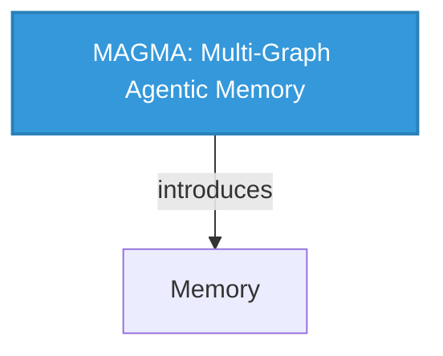
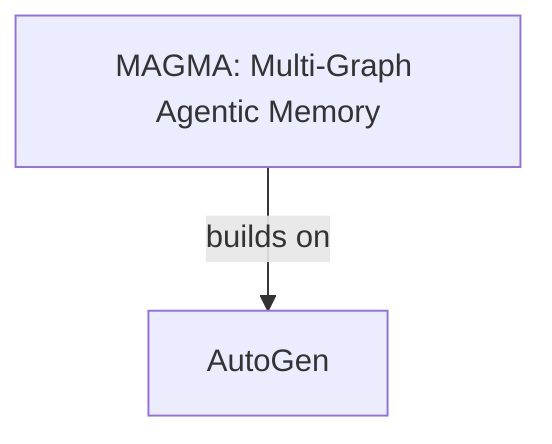

# Memory Graph (Semantic Memory) / 记忆图谱

## STATUS
✅ **Active** - Implementation complete in `tools/memory_graph.py` and `tools/memory_system.py`
Integration pending for research workflow and report generation

---

## Overview / 概述

Knowledge graph implementation for the MAGMA semantic memory layer. Stores research findings as connected entities.

Based on: [MAGMA: Multi-Graph Agentic Memory Architecture](https://arxiv.org/abs/2601.03236) [arXiv:2601.03236](https://arxiv.org/abs/2601.03236)

---

## Graph Structure / 图结构

### Nodes / 节点

**Node Types**:
```python
class NodeType(Enum):
    ACADEMIC_PAPER = "academic_paper"      # 论文
    GITHUB_PROJECT = "github_project"      # 项目
    COMMUNITY_DISCUSSION = "community_discussion"  # 讨论
    CONCEPT = "concept"                    # 概念
    AUTHOR = "author"                      # 作者
    FRAMEWORK = "framework"                # 框架
    TECHNIQUE = "technique"                # 技术
    DATASET = "dataset"                    # 数据集
    METRIC = "metric"                      # 指标
```

**Node Attributes**:
```python
@dataclass
class GraphNode:
    id: str                      # Unique identifier
    type: NodeType               # Node type
    attributes: Dict[str, Any]   # Node metadata
```

---

### Edges / 边

**Edge Types**:
```python
class EdgeType(Enum):
    CITES = "cites"              # Paper cites paper
    IMPLEMENTS = "implements"    # Project implements paper
    DISCUSSES = "discusses"      # Discussion discusses paper
    RELATED_TO = "related_to"    # General relatedness
    AUTHORED_BY = "authored_by"  # Paper authored by
    USES_FRAMEWORK = "uses_framework"  # Project uses framework
    INTRODUCES = "introduces"    # Paper introduces concept
    EVALUATES_ON = "evaluates_on"  # Paper evaluates on dataset
    OPTIMIZES = "optimizes"      # Paper optimizes metric
    SIMILAR_TO = "similar_to"    # Semantic similarity
```

**Edge Attributes**:
```python
@dataclass
class GraphEdge:
    source: str                  # Source node ID
    target: str                  # Target node ID
    type: EdgeType               # Relationship type
    attributes: Dict[str, Any]   # Edge metadata
    weight: float = 1.0          # Relationship strength
```

---

## Core Operations / 核心操作

### Adding Papers / 添加论文

```python
memory.add_paper({
    "arxiv_id": "2501.03236",
    "title": "MAGMA: Multi-Graph Agentic Memory",
    "authors": ["Author Name"],
    "year": 2025,
    "abstract": "...",
    "citation_count": 10,
    "url": "https://arxiv.org/abs/2501.03236",
    "key_concepts": ["memory", "knowledge graph", "multi-agent"],
    "type": "sota"  # root, sota, survey
})
```

**Creates**:
- Paper node
- Author nodes (with AUTHORED_BY edges)
- Concept nodes (with INTRODUCES edges)

---

### Adding Projects / 添加项目

```python
memory.add_project({
    "name": "langchain-ai/langgraph",
    "description": "Stateful agent framework",
    "stars": "50k+",
    "language": "Python",
    "framework_type": "LangGraph",
    "implements_papers": ["2506.12508"]  # AgentOrchestra paper
})
```

**Creates**:
- Project node
- Framework edge (if specified)
- Implementation edges to papers

---

### Adding Discussions / 添加讨论

```python
memory.add_discussion({
    "platform": "reddit",
    "title": "LangGraph vs CrewAI discussion",
    "url": "https://reddit.com/...",
    "upvotes": 100,
    "papers_discussed": ["2506.12508"],
    "consensus_level": "mixed"
})
```

---

## Graph Analysis / 图分析

### Neighbors / 邻居查询

```python
# Get all neighbors (1-hop)
neighbors = memory.get_neighbors(node_id, max_depth=1)

# Get citation neighbors only
citations = memory.get_neighbors(node_id, EdgeType.CITES, max_depth=2)

# Get concept neighbors (2-hop)
concepts = memory.get_neighbors(paper_id, EdgeType.INTRODUCES, max_depth=1)
related_papers = []
for concept in concepts:
    related_papers.extend(memory.get_neighbors(concept, EdgeType.INTRODUCES))
```

---

### Path Finding / 路径查找

```python
# Shortest path between two entities
path = memory.find_shortest_path(source_paper, target_paper)
# Returns: ["paper_source", "concept_X", "paper_target"]
```

---

### Centrality Metrics / 中心性指标

```python
# PageRank (importance ranking)
pagerank_scores = memory.get_pagerank(alpha=0.85)

# Find related papers by combined metrics
related = memory.find_related_papers(arxiv_id, top_k=5)
```

---

## Citation Network / 引用网络

**Specialized Class**:
```python
class CitationNetwork:
    def __init__(self, semantic_memory: SemanticMemory):
        self.memory = semantic_memory
        self._root_papers: Set[str] = set()
        self._survey_papers: Set[str] = set()
```

**Building Citation Networks**:
```python
citation_net.add_paper_with_citations(
    paper_id="2501.03236",
    cites=["2308.00352", "2308.08155"],
    paper_type="sota"
)

# Get citation chain
chain = citation_net.get_citation_chain("2501.03236", max_depth=3)
```

---

## Visualization / 可视化

### Mermaid Diagram / Mermaid 图表

```python
mermaid_code = memory.to_mermaid()
```

**Generates**:


---

### HTML Visualization / HTML 可视化

```python
# Interactive HTML (requires pyvis)
html_path = memory.visualize(
    output_path="research_output/visualizations/graph.html",
    format="html",
    height="600px",
    width="100%"
)
```

**Features**:
- Hierarchical layout
- Color-coded by node type
- Interactive exploration
- Export to PNG/SVG (requires matplotlib)

---

### Gephi Export / Gephi 导出

```python
# GraphML format
memory.export_graphml("output.graphml")

# GEXF format
memory.export_gexf("output.gexf")
```

---

## CLI Usage / 命令行使用

### Memory Graph CLI (NEW - v1.0)

```bash
# Build graph from research data
python "tools\memory_graph_cli.py" --build

# Query related papers
python "tools\memory_graph_cli.py" --query 2501.03236

# Generate visualization
python "tools\memory_graph_cli.py" --visualize --format html
python "tools\memory_graph_cli.py" --visualize --format mermaid

# Show graph statistics
python "tools\memory_graph_cli.py" --stats

# Export to GraphML for Gephi
python "tools\memory_graph_cli.py" --export-graphml output.graphml

# Batch generate all visualizations
python "tools\generate_visualizations.py"
```

### Legacy memory_graph.py (still available)

```bash
# Build graph from research data
python "tools\memory_graph.py" --build

# Query related papers
python "tools\memory_graph.py" --query 2501.03236

# Load existing graph
python "tools\memory_graph.py" --load research_data/semantic_graph.json

# Show graph statistics
python "tools\memory_graph.py" --stats

# Save graph
python "tools\memory_graph.py" --save research_data/semantic_graph.json
```

---

## Storage / 存储

**JSON Format**:
```json
{
  "nodes": [
    {
      "id": "paper_2501.03236",
      "type": "academic_paper",
      "attributes": {
        "title": "MAGMA Memory",
        "authors": ["..."],
        "year": 2025
      }
    }
  ],
  "edges": [
    {
      "source": "paper_2501.03236",
      "target": "concept_memory",
      "type": "introduces",
      "weight": 1.0
    }
  ],
  "stats": {
    "node_count": 100,
    "edge_count": 250,
    "node_types": {"academic_paper": 30, "github_project": 20, ...}
  }
}
```

---

## Dependencies / 依赖

| Feature | Required | Optional | Fallback |
|---------|----------|----------|----------|
| Basic graph operations | - | ✓ | Adjacency list |
| NetworkX integration | - | ✓ networkx | Pure Python |
| HTML visualization | - | ✓ pyvis | Mermaid |
| Image export | - | ✓ matplotlib | Error |
| Graph algorithms | - | ✓ networkx | BFS/DFS |

---

## Related Modules / 相关模块

- **memory_system.py**: MAGMAMemory using SemanticMemory
- **hybrid_retriever.py**: GraphRetriever using SemanticMemory
- **visualization.py**: Extended visualization capabilities

---

## Node Color Scheme / 节点颜色方案

| Type | Color | Hex |
|------|-------|-----|
| Academic Paper (SOTA) | Blue | #3498db |
| Academic Paper (Root) | Red | #e74c3c |
| Academic Paper (Survey) | Orange | #f39c12 |
| GitHub Project | Green | #2ecc71 |
| Community Discussion | Orange | #e67e22 |
| Concept | Purple | #9b59b6 |
| Author | Gray | #95a5a6 |
| Framework | Red | #e74c3c |
```

---

## Usage in Reports / 在报告中使用

### Citation Network Visualization

**In Comprehensive Reports**:
```python
# Generate Mermaid diagram
mermaid_code = memory.semantic.to_mermaid()

# Include in report
```markdown
## Citation Network

```mermaid
{mermaid_code}
```
```

**Example Output**:


---

### Finding Related Papers

**For Literature Reviews**:
```python
# Find papers related to a given paper
related = memory.semantic.find_related_papers("2501.03236", top_k=5)

# Output for report
for paper_id, score in related:
    print(f"- [{paper_id}](https://arxiv.org/abs/{paper_id}) (similarity: {score:.2f})")
```

---

### Implementation Tracking

**Cross-Domain Relationships**:
```python
# Get projects implementing a paper
implementations = memory.get_neighbors(
    f"paper_{arxiv_id}",
    edge_type=EdgeType.IMPLEMENTS
)

# Report text
if implementations:
    print(f"Paper implemented by {len(implementations)} projects:")
    for impl in implementations:
        print(f"- [{impl}]({impl_url})")
```

---

### PageRank Importance Scores

**For Executive Summary**:
```python
# Get importance scores
pagerank = memory.semantic.get_pagerank()

# Top 5 most important papers
top_papers = sorted(pagerank.items(), key=lambda x: x[1], reverse=True)[:5]

# Report format
for paper_id, score in top_papers:
    print(f"{paper_id}: {score:.4f} importance score")
```

---

### Visualization in Reports

**HTML Embedding**:
```python
# Generate interactive HTML
html_path = memory.semantic.visualize(
    output_path="research_output/visualizations/citation_network.html",
    format="html"
)

# Embed in markdown report
```markdown
## Interactive Citation Network

<iframe src="visualizations/citation_network.html" width="100%" height="600"></iframe>
```
```

---

## Common Workflows / 常见工作流

### Workflow 1: Paper Discovery → Citation Network

```python
# 1. Add papers as they're discovered
for paper in papers:
    memory.add_paper(paper)

# 2. Generate citation network
mermaid = memory.semantic.to_mermaid()

# 3. Find most connected papers
pagerank = memory.semantic.get_pagerank()
```

### Workflow 2: Cross-Domain Analysis

```python
# 1. Add papers
memory.add_paper(paper_data)

# 2. Add implementing projects
for repo in repos:
    memory.add_project(repo)
    # Automatically creates IMPLEMENTS edges

# 3. Add community discussions
for discussion in discussions:
    memory.add_discussion(discussion)
    # Automatically creates DISCUSSES edges

# 4. Query cross-domain relationships
bridging = find_bridging_entities(min_domains=2)
```

### Workflow 3: Literature Review Support

```python
# 1. Load existing graph
memory.load("research_data/semantic_graph.json")

# 2. For each paper in review, find related work
for paper_id in review_papers:
    related = memory.semantic.find_related_papers(paper_id, top_k=3)
    # Use for "Related Work" section

# 3. Trace citation chains
for paper_id in key_papers:
    chain = memory.semantic.find_shortest_path(paper_id, root_paper)
    # Use for evolution narrative
