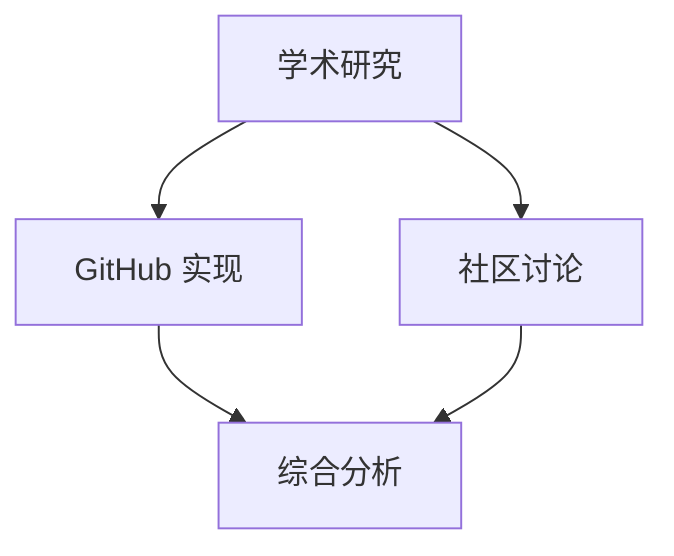

# Report Templates Knowledge Base

## Overview
从 `output_formatter.py` 提取的报告模板和格式化核心逻辑

**Purpose**: 提供 Gemini Deep Research 风格的报告模板和输出格式规范

---

## Key Classes / 类

### ReportFormat

**Purpose**: 报告格式枚举

**Values**:
- `COMPREHENSIVE`: 综合报告 (6,000-8,000 字)
- `LITERATURE_REVIEW`: 文献综述 (3,000-5,000 字)
- `EXECUTIVE_SUMMARY`: 执行摘要 (500-1,000 字)
- `TECHNICAL_BRIEF`: 技术简报 (2,000-3,000 字)

### CitationStyle

**Purpose**: 引用风格枚举

**Values**:
- `ARXIV_MARKDOWN`: arXiv Markdown 格式
- `GITHUB_MARKDOWN`: GitHub Markdown 格式
- `COMMUNITY_MARKDOWN`: 社区讨论 Markdown 格式

### ReportTemplate

**Purpose**: 报告模板类

**Key Methods**:
- `generate_comprehensive_report(data)`: 生成综合报告
- `generate_literature_review(data)`: 生成文献综述
- `generate_executive_summary(data)`: 生成执行摘要
- `format_citation(source, style)`: 格式化引用
- `add_citation_graph(sources)`: 添加引用关系图 (Mermaid)

### BilingualFormatter

**Purpose**: 双语格式化器

**Key Methods**:
- `format_header(chinese, english)`: 格式化双语标题
- `format_section(chinese, english)`: 格式化双语章节
- `check_consistency(content)`: 检查双语一致性

---

## Report Templates / 报告模板

### Comprehensive Report Template (v3.0)

```markdown
# {Topic}: 深度研究报告 / {Topic}: Deep Research Report

**Generated**: {date}
**Research Methodology**: Multi-agent synthesis (academic + GitHub + community)

---

## Executive Summary / 执行摘要

### Key Insights / 核心洞察

1. **[Insight 1]**
   - **Evidence**: [支持证据]
   - **Citations**: [{cite}]
   - **Impact**: [影响分析]

2. **[Insight 2]**
   ...

### Practical Recommendations / 实践建议

1. **Framework Selection**: Based on [criteria], [framework] is recommended for [use case]
2. **Implementation Priority**: [High/Medium/Low] - [reasoning]
3. **Risk Assessment**: [风险描述]

---

## 1. Academic Research / 学术研究

### 1.1 Core Papers / 核心论文

| Paper | Key Finding | Relevance |
|-------|-------------|-----------|
| [{Paper 1}] | [{finding}] | [{relevance}] |
| [{Paper 2}] | [{finding}] | [{relevance}] |

### 1.2 Research Evolution / 研究演进

**从 [{Old Method}] 到 [{New Method}] 的演进**:

[{Evolution narrative with causal connections}]

### 1.3 Methodology Comparison / 方法论对比

**[{Methodology Family}]**:

| Aspect | [{Paper A}] | [{Paper B}] | [{Paper C}] |
|--------|-------------|-------------|-------------|
| [{Dimension 1}] | [{value}] | [{value}] | [{value}] |

---

## 2. GitHub Ecosystem / GitHub 生态

### 2.1 Key Repositories / 关键仓库

| Repository | Stars | Last Update | Description |
|------------|-------|-------------|-------------|
| [{repo 1}] | [{stars}] | [{date}] | [{description}] |
| [{repo 2}] | [{stars}] | [{date}] | [{description}] |

### 2.2 Architecture Analysis / 架构分析

**[{Repository Name}]**:
- **Key Files**: [{files}]
- **Architecture**: [{analysis}]
- **Integration**: [{examples}]

---

## 3. Community Consensus / 社区共识

### 3.1 Platform Discussions / 平台讨论

**[{Platform}] - [{Thread Title}]** [{link}]
- **Key Quote**: [{user}]: "{quote}"
- **Consensus**: [{level}]
- **Summary**: [{summary}]

### 3.2 Chinese Community Insights / 中文社区洞察

[{Insights from Chinese community sources}]

---

## 4. Synthesis / 综合

### 4.1 Research-Practice Alignment / 研究-实践对齐

[{How academic findings align with GitHub implementations and community discussions}]

### 4.2 Identified Gaps / 已识别空白

1. **[Gap 1]**: [{description}]
   - **Evidence**: [{citations}]
   - **Potential Causes**: [{reasons}]

### 4.3 Emerging Trends / 新兴趋势

1. **[Trend 1]**: [{description}]
   - **Drivers**: [{factors}]

---

## 5. Technical Implementation / 技术实现

### 5.1 Framework Decision Matrix / 框架决策矩阵

| Use Case | Recommended Framework | Rationale |
|----------|----------------------|-----------|
| [{case 1}] | [{framework}] | [{reason}] |

### 5.2 Code Patterns / 代码模式

```python
# [{Pattern name}]
[{Code example with explanation}]
```

---

## Citation Graph / 引用关系图



---

## References / 参考文献

### Academic Papers
1. [{Author}] et al. ({year}). "[{Title}](https://arxiv.org/abs/{id})". [{venue}].

### GitHub Repositories
1. [{owner/repo}] - [{description}](https://github.com/{owner}/{repo})

### Community Discussions
1. [{Platform}] - [{Thread Title}]({url})
```

### Literature Review Template

```markdown
# {Topic}: 文献综述 / {Topic}: A Literature Review

**Abstract / 摘要**
- **Background**: [1-2 sentences]
- **Main Findings**: [3-4 sentences, organized by evolution path]
- **Research Gaps**: [1-2 sentences]
- **Keywords**: [5-7 keywords]

---

## 1. Introduction / 引言

### 1.1 Background and Motivation / 研究背景与动机

[{Logical narrative starting from root papers}]

### 1.2 Scope and Organization / 综述范围与结构

[{Clear scope definition and organization预告}]

---

## 2. Research Evolution / 研究演进

### 2.1 Foundation Work / 奠基性工作

**[{Root Paper}]**
- **Core Contribution**: [{从逻辑分析提取}]
- **Limitations**: [{局限}] → [引发后续研究方向]

### 2.2 Methodological Evolution / 方法论演进

**从 [{Method A}] 到 [{Method B}] 的演进**:

[Early work] 采用 [Method A]，**然而**，这种方法面临 [limitation]。**为解决这一问题**，[Paper B] 提出了 [Method B]，通过 [key innovation] 实现了...

### 2.3 Paradigm Shifts / 范式转移

**[{Paradigm name}]**: 触发论文 [Paper]，原因是 [reason]，影响评估 [impact]。

---

## 3. Thematic Analysis / 主题分析

### 3.1 [{Theme 1}]

**共同关注点**: [Papers A, B, C] 都关注 [theme]，但采用不同方法...

**方法论家族**:

| Methodology | Representative Papers | Core Method | Pros | Cons |
|-------------|------------------------|-------------|------|------|
| [{Family}] | [{Papers}] | [{Method}] | [{Pros}] | [{Cons}] |

---

## 4. Research Gaps and Future Directions / 研究空白与未来方向

### 4.1 Identified Gaps / 已识别空白

**空白 1: [{Gap name}]**
- **描述**: [从逻辑分析提取]
- **证据**: [Papers指出...]
- **可能原因**: [原因分析]
- **填补方向**: [方向建议]

### 4.2 Open Questions / 开放问题

**[{Question name}]**
- **问题描述**: [从逻辑分析提取]
- **相关研究**: [Papers探讨了...]
- **可能方向**: [方向建议]

---

## 5. Conclusion / 结论

### 5.1 Summary of Findings / 主要发现总结

按演进路径总结:
1. **奠基阶段** (2023 Q3): [Papers] 建立了基础框架...
2. **演进阶段** (2024): [Papers] 提出了... **实现了从 [old] 到 [new] 的演进**
3. **前沿阶段** (2025): [Papers] 探索了...

### 5.2 Recommendations for Future Research / 未来研究建议

**短期方向** (1-2 年):
- [基于空白的建议]

**长期方向** (3-5 年):
- [基于趋势的建议]

---

## References / 参考文献

[按引用顺序排列]
```

---

## Citation Formats / 引用格式

### arXiv Paper Citation

```markdown
[{arxiv_id}] - [{title}](https://arxiv.org/abs/{arxiv_id}) | [PDF](https://arxiv.org/pdf/{arxiv_id}.pdf)
```

**Example**:
```markdown
[2402.01680] - [Multi-Agent Systems: A Comprehensive Survey](https://arxiv.org/abs/2402.01680) | [PDF](https://arxiv.org/pdf/2402.01680.pdf)
```

### GitHub Repository Citation

```markdown
[{name}] - [{owner/repo}](https://github.com/{owner}/{repo}) ⭐ {stars}
```

**Example**:
```markdown
[LangGraph] - [langchain-ai/langgraph](https://github.com/langchain-ai/langgraph) ⭐ 15k+
```

### Community Discussion Citation

```markdown
[{platform}] - [{title}]({url})
```

**Example**:
```markdown
[Reddit] - [What's the best multi-agent framework for production?](https://reddit.com/r/ML/comments/xyz)
```

---

## CLI Usage / 命令行使用

```bash
python "tools\output_formatter.py" --comprehensive research_data/*.json
python "tools\output_formatter.py" --literature-review research_data/logic_analysis.json
python "tools\output_formatter.py" --template report_templates.md
```

**Commands**:
- `--comprehensive`: 生成综合报告
- `--literature-review`: 生成文献综述
- `--template`: 使用自定义模板

---

## Integration Points / 集成点

**Reading Agents**:
- `deep-research-report-writer`: 使用报告模板生成综合报告
- `literature-review-writer`: 使用文献综述模板

**CLI Invocations**:
```bash
# Generate report from research data
python "tools\output_formatter.py" --comprehensive --output "research_output/report.md"
```

**Related Knowledge Base**:
- `.claude/knowledge/quality_checklist.md`: 质量检查相关

---

## Bilingual Format Standards / 双语格式标准

### Header Format

```markdown
# {Chinese Title} / {English Title}

## {Chinese Section} / {English Section}

### {Chinese Subsection} / {English Subsection}
```

### Key Terms Format

```markdown
**{English Term} ({中文术语})**: {description}

# OR

{中文描述} (**English Term**)
```

### Code Comment Format

```python
# {Chinese comment} / {English comment}

# Example:
# 检查质量阈值是否满足 / Check if quality threshold is met
if score >= threshold:
    return True
```

---

## Notes / 说明

- **v3.0 Template**: 综合报告目标 6,000-8,000 字 (简洁版)
- **Bilingual Consistency**: 所有标题和关键术语必须双语
- **Clickable Citations**: 所有引用必须是可点击的 Markdown 链接
- **Citation Graph**: 使用 Mermaid.js 可视化引用关系
- **LaTeX Formulas**: 使用 `$$...$$` 行间公式，`$...$` 行内公式
